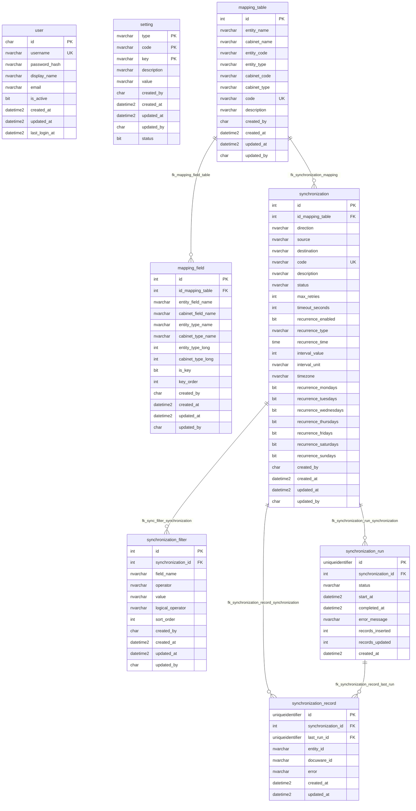
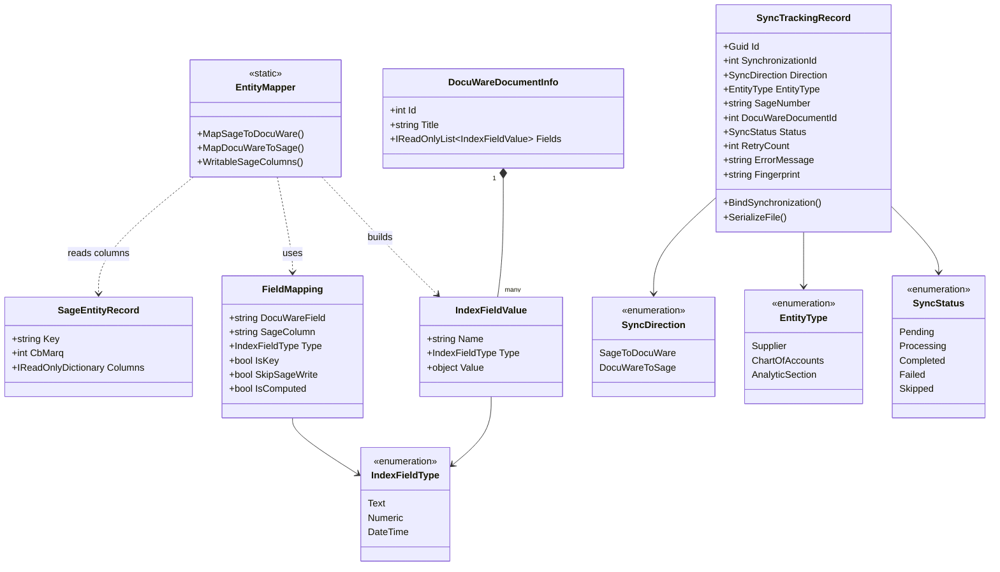
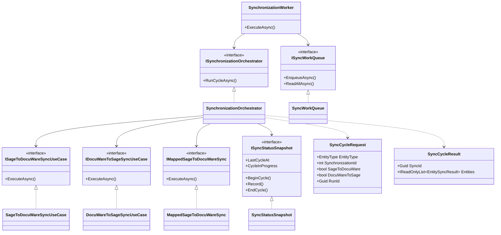

# DocuWare Sage 100 Connector

ASP.NET Core 10 API and background worker that keep Sage 100 SQL data in step with DocuWare file cabinets. The operator console is the React app in [`frontend/`](frontend/README.md).

HTTP requests queue work. They do not hold a full sync cycle open. The worker, in the same process as the API, runs the built-in entity cycle and any named synchronization that is due.

The connector store is the SQL Server database defined in [`Database/schema.sql`](Database/schema.sql). Database name: `one_connector`.

## Built-in entities

| Sage table | Filter | DocuWare cabinet (default name) | Key |
|---|---|---|---|
| `dbo.F_COMPTET` | `CT_Type = 1` | Fournisseur | `NUM` / `CT_Num` |
| `dbo.F_COMPTEG` | `CG_Type = 0` | Plan Comptable | `CG_NUM` / `CG_Num` |
| `dbo.F_COMPTEA` | all rows | Section analytique | `CODE` / `CA_Num` |

Operators can also define field mappings and named synchronizations in the console. A named synchronization points at one mapping and runs one way (Sage to DocuWare, or DocuWare to Sage) or both ways. The worker claims due rows, applies the chosen direction, and records success or failure. `POST /api/synchronizations/{id}/run` queues one immediately.

## Data model

Eight tables. Foreign keys are the only relationships the schema enforces. `created_by` and `updated_by` store a `user.id` as `char(36)`, and they have no foreign key.



| Table | Role |
|---|---|
| `user` | Operator account. `username` is unique. `is_active` defaults to `1`. |
| `setting` | DocuWare, Sage, and sync key/value rows. Primary key is `(type, code, key)`. `status` defaults to `0`. |
| `mapping_table` | One Sage entity paired with one DocuWare cabinet. `code` is unique. The entity and cabinet identity together are unique. |
| `mapping_field` | Field pair on a mapping. Unique on `(id_mapping_table, entity_field_name)`. Deleting the mapping deletes its fields. `is_key` defaults to `0`. |
| `synchronization` | Named job on one mapping. `code` is unique. `status` is `success`, `failed`, or null. Recurrence is `DAILY`, `WEEKLY`, or `INTERVAL` when enabled. |
| `synchronization_filter` | Ordered predicate on a job. `logical_operator` defaults to `AND`. Deleting the job deletes its filters. |
| `synchronization_run` | One execution. `status` is `pending`, `running`, `success`, or `failed`. Counts must be zero or greater. `completed_at` is null or at or after `start_at`. |
| `synchronization_record` | Last outcome of one source row. Unique on `(synchronization_id, entity_id)`. `last_run_id` points at the run that wrote it. |

`mapping_field.id_mapping_table` and `synchronization_filter.synchronization_id` cascade on delete. The other foreign keys do not.

## Class model

Namespaces under `DocuWareSageConnector`. Controllers depend on application interfaces. Infrastructure and the DocuWare and Sage adapters implement those interfaces. Domain types do not reference the DocuWare SDK or `Microsoft.Data.SqlClient`.

### Domain



`ErrorClass` is `Transient` or `Permanent`. `DocuWareAuthenticationMode` is `UserPassword` or `AppRegistration`. `SageAuthenticationMode` is `Windows` or `Sql`.

### Application



Store contracts and the rows they read and write:

```mermaid
classDiagram
    class IEntityMappingStore {
        <<interface>>
        +ListAsync()
        +CreateAsync()
        +AddFieldAsync()
    }

    class SqlEntityMappingStore

    class ISynchronizationStore {
        <<interface>>
        +ListAsync()
        +ClaimAsync()
        +CompleteAsync()
        +ListFiltersAsync()
    }

    class SynchronizationStore

    class ISynchronizationExecutionStore {
        <<interface>>
        +ListRunsAsync()
        +UpsertRecordAsync()
        +ListRecordsAsync()
    }

    class SynchronizationExecutionStore

    class IConnectorIdentity {
        <<interface>>
        +LoginAsync()
        +AuthenticateAsync()
    }

    class ConnectorIdentityStore

    class IDocuWareSettingsStore {
        <<interface>>
    }

    class DocuWareSettingsStore

    class ISageSettingsStore {
        <<interface>>
    }

    class SageSettingsStore

    class ISynchronizationSettingsStore {
        <<interface>>
    }

    class SynchronizationSettingsStore

    class IConfigurationCatalog {
        <<interface>>
    }

    class ConfigurationCatalogStore

    class ISyncTrackingStore {
        <<interface>>
        +UpsertAsync()
        +ListErrorsAsync()
    }

    class SqlSyncTrackingStore

    class IDocuWareDocumentService {
        <<interface>>
        +FindByKeyAsync()
        +CreateDocumentAsync()
        +FindInCabinetAsync()
    }

    class DocuWareDocumentService

    class ISageEntityRepository {
        <<interface>>
        +GetAllAsync()
        +UpdateAsync()
        +InsertAsync()
    }

    class SageSqlEntityRepository

    class ISageRepositoryFactory {
        <<interface>>
        +Get()
    }

    class SageRepositoryFactory

    IEntityMappingStore <|.. SqlEntityMappingStore
    ISynchronizationStore <|.. SynchronizationStore
    ISynchronizationExecutionStore <|.. SynchronizationExecutionStore
    IConnectorIdentity <|.. ConnectorIdentityStore
    IDocuWareSettingsStore <|.. DocuWareSettingsStore
    ISageSettingsStore <|.. SageSettingsStore
    ISynchronizationSettingsStore <|.. SynchronizationSettingsStore
    IConfigurationCatalog <|.. ConfigurationCatalogStore
    ISyncTrackingStore <|.. SqlSyncTrackingStore
    IDocuWareDocumentService <|.. DocuWareDocumentService
    ISageEntityRepository <|.. SageSqlEntityRepository
    ISageRepositoryFactory <|.. SageRepositoryFactory
    SageRepositoryFactory --> ISageEntityRepository

    SqlEntityMappingStore ..> mapping_table
    SqlEntityMappingStore ..> mapping_field
    SynchronizationStore ..> synchronization
    SynchronizationStore ..> synchronization_filter
    SynchronizationExecutionStore ..> synchronization_run
    SynchronizationExecutionStore ..> synchronization_record
    ConnectorIdentityStore ..> user
    DocuWareSettingsStore ..> setting
    SageSettingsStore ..> setting
    SynchronizationSettingsStore ..> setting
```



API controllers are `AuthController`, `HealthController`, `ConfigurationController`, `CabinetsController`, `MappingsController`, `SynchronizationsController`, and `SyncController`. Each is a `ControllerBase`. Mapping and synchronization requests use `EntityMappingDto`, `EntityMappingFieldDto`, `SynchronizationRecordDto`, `SynchronizationFilterDto`, `SynchronizationRunDto`, and `SynchronizationSourceRecordDto` in `Application/DTOs`.

## Quick start

Requirements: .NET 10 SDK, Node.js 22 or newer, SQL Server for the connector store and for the Sage company database, and a DocuWare Cloud or on-prem Platform user. ODBC is not required. Both databases use `Microsoft.Data.SqlClient`.

```powershell
cd docuware_sage_100_connector
copy .env.example .env
```

Fill `ConnectorStore__Server`, `ConnectorStore__Database`, `ConnectorStore__LoginMode`, and `ConnectorStore__SecretsKey` in `.env`. `ConnectorStore__LoginMode` is `Windows_Login` or `SQL_Server_Login`.

- `Windows_Login` uses the Windows account that runs the API or CLI. Leave `ConnectorStore__User` and `ConnectorStore__Password` empty. That account needs access to the database.
- `SQL_Server_Login` uses a SQL Server login. Set `ConnectorStore__User` and `ConnectorStore__Password`. The instance must allow SQL Server authentication.

DocuWare, Sage, synchronization settings, mappings, named synchronizations, and operator accounts live in that SQL Server database, not in `appsettings.json`. On an empty database, the first start applies [`Database/schema.sql`](Database/schema.sql) and inserts blank setting rows. Fill those rows in SQL Server, then restart the API.

```powershell
dotnet run --launch-profile http
```

In a second terminal:

```powershell
cd frontend
npm install
npm run dev
```

- API: `http://localhost:5175`
- UI: `http://localhost:5173`
- OpenAPI (Development): `http://localhost:5175/openapi/v1.json`
- Health: `GET /api/health` (no sign-in)
- UI tests: `npm test` from `frontend/`

`appsettings.Development.json` sets `Synchronization:Enabled` to `false`, so the worker does not poll. `POST /api/synchronizations/{id}/run` still queues that job. To poll locally, set `Synchronization:Enabled` to `true` in that file, or remove the key so the SQL Server value is used.

The HTTPS launch profile is `--launch-profile https` (`https://localhost:7277`).

## Add an operator

Operator accounts are rows in the SQL Server `user` table. This command does not start the API and is not an HTTP route. Run it from this folder so it can read `.env`:

```powershell
dotnet run --project Cli -- add-user --username admin
```

The command prompts for a password (8 to 256 characters) so it stays out of shell history. To pass it on the command line instead:

```powershell
dotnet run --project Cli -- add-user --username admin --password "change-me" --display-name "Admin" --email admin@example.com
```

`--display-name` and `--email` are optional. The username must be unique. Sign in with that username and password in the operator console.

## Where settings live

| Kind | Where |
|---|---|
| SQL Server connection and the secrets key | `.env` or environment variables. Not committed. |
| DocuWare, Sage, and sync settings | SQL Server `setting` key/value rows. Passwords are encrypted with `ConnectorStore__SecretsKey`. |
| Mappings and named synchronizations | SQL Server `mapping_table`, `mapping_field`, and `synchronization`. |
| Synchronization history | SQL Server `synchronization_run` and `synchronization_record`. |
| Operator passwords | `user.password_hash`. The UI stores a signed bearer token. |
| API origin and status refresh | `frontend/.env.development` or `frontend/.env`. Public in the built bundle. |

`GET /api/health` and `POST /api/auth/login` do not require a session. Other routes require `Authorization: Bearer`. `GET /api/configuration` returns passwords and the DocuWare client secret as configured/not-configured flags. Revealing a stored secret requires the operator's own password.

## Documentation

Deeper notes are in [docs/](docs/).

| Topic | Document |
|---|---|
| Architecture and project layout | [docs/architecture.md](docs/architecture.md) |
| Configuration and secrets | [docs/configuration.md](docs/configuration.md) |
| DocuWare authentication | [docs/docuware.md](docs/docuware.md) |
| Sage SQL | [docs/sage.md](docs/sage.md) |
| Field mapping | [docs/mapping.md](docs/mapping.md) |
| Sync flows | [docs/synchronization.md](docs/synchronization.md) |
| State, retries, and errors | [docs/reliability.md](docs/reliability.md) |
| Local run and production hosting | [docs/development.md](docs/development.md) |
| API routes | [docs/api.md](docs/api.md) |
| Connectivity checks | [docs/troubleshooting.md](docs/troubleshooting.md) |
| Administration UI | [frontend/README.md](frontend/README.md), [docs/frontend-architecture.md](docs/frontend-architecture.md) |
