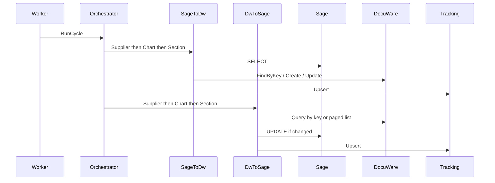

# Architecture

The connector is a single ASP.NET Core 10 web project with a hosted `BackgroundService`. Folders isolate layers. The DocuWare SDK and Sage SQL client never leak into Domain or API DTOs.

```text
API / Worker
    -> Application use cases
        -> IDocuWareDocumentService
        -> ISageEntityRepository
        -> ISyncTrackingStore
```

## Design decisions

- **DocuWare SDK is isolated behind an adapter.** Domain models (`IndexFieldValue`, `DocuWareDocumentInfo`) keep business logic independent from `ServiceConnection` / `Document`. The SDK can be upgraded without rewriting sync rules.
- **Synchronization uses `BackgroundService`.** Long-running sync must not block HTTP. The API queues work; the worker runs it with `CancellationToken`.
- **Configuration is externalized.** No platform URL, cabinet GUID, SQL instance, or secret is hardcoded. Names such as `Fournisseur` are defaults, not environment IDs.
- **Synchronization is idempotent.** Sage→DocuWare skips when the field fingerprint is unchanged. DocuWare→Sage skips when writable Sage columns already match. Existing DocuWare documents are found by key field before create.
- **Sage access is abstracted.** `ISageEntityRepository` is SQL today so it can be replaced with Sage Web Services later without rewriting use cases.

## Project structure

```text
docuware_sage_100_connector/
  Api/Controllers/
  Application/{Interfaces,Services,UseCases,DTOs}
  Domain/{Entities,Enums,Mapping}
  Infrastructure/{Persistence,Configuration,Synchronization}
  DocuWare/{Authentication,Clients,Documents,FileCabinets,Mapping}
  Sage/{Sql,Queries,Repositories}
  Worker/
  docs/
```

Tests live in `docuware_sage_100_connector.Tests`.

## Runtime flow



One entity or direction failing does not stop the rest of the cycle.
